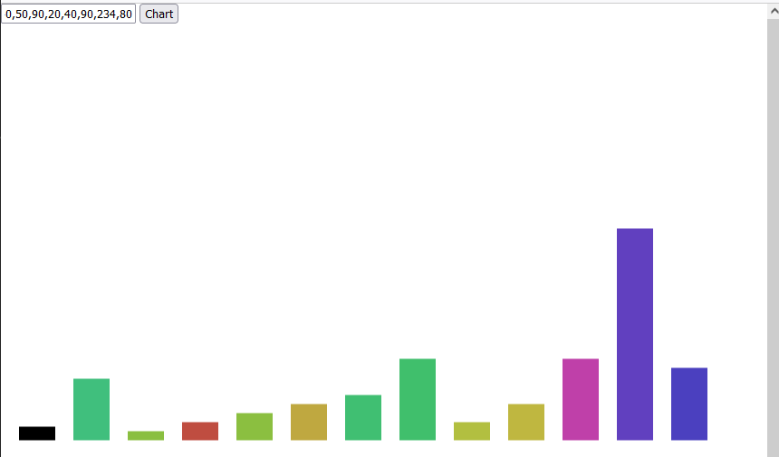

# BarChart-JS
An example and very simplistic of how creating a bar chart using only Vanilla Javascript.

## How to use
Clone the repository and open the index.html file and update the Text-Input field by separating the values using semicolon character.

## Example

## License
MIT License

## Author
Eduardo Diogo Garcia /
eduardo.diogo@gmail.com
